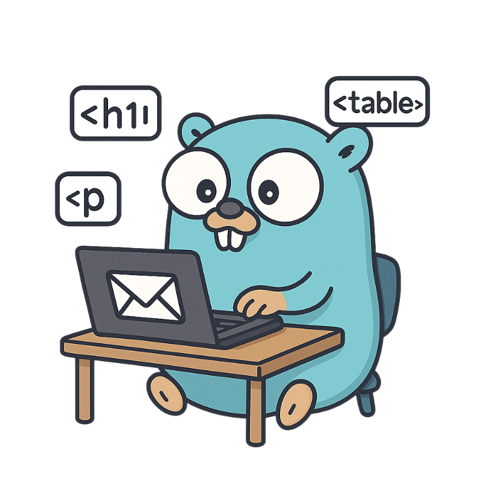
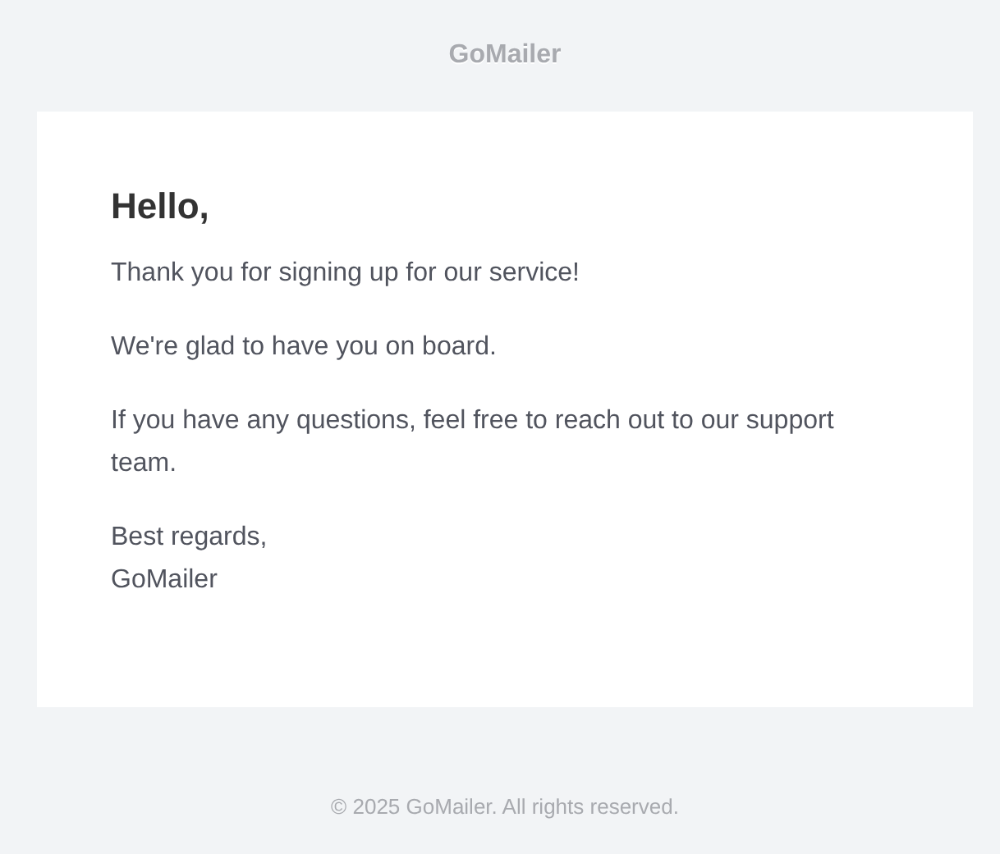
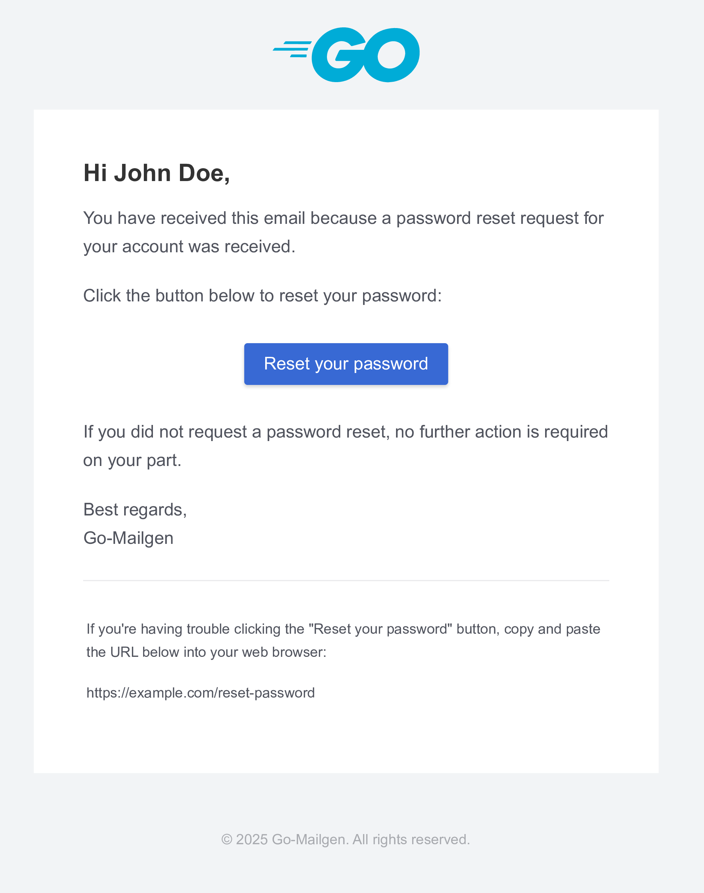
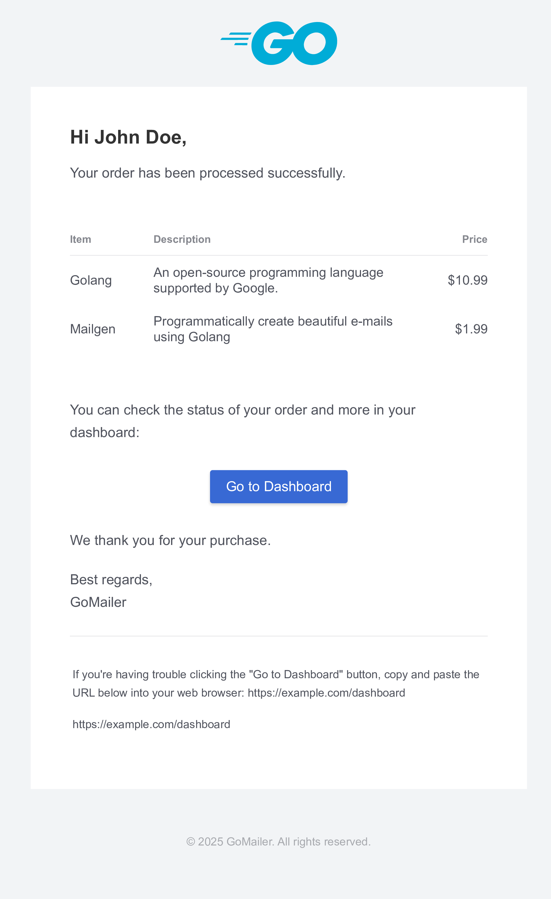
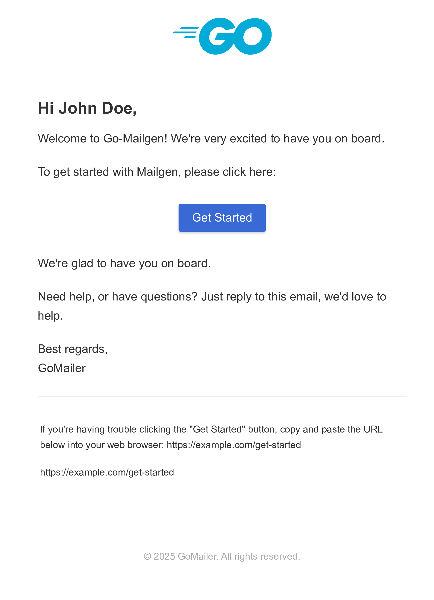
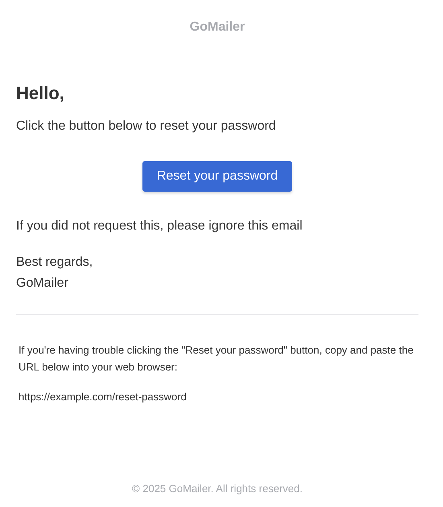
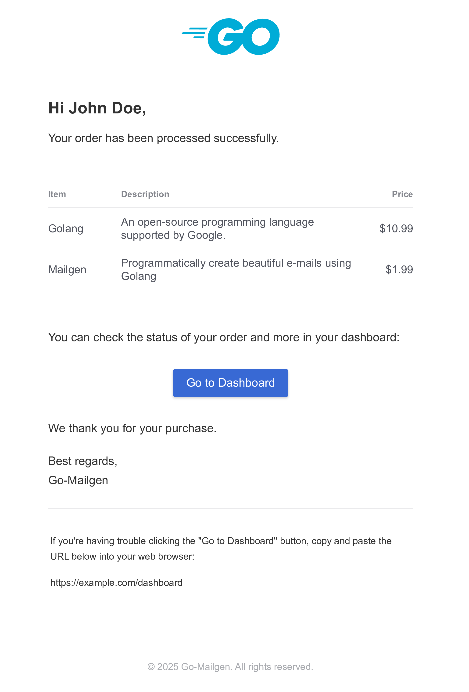

# Go-Mailgen

[](https://github.com/akfaiz/go-mailgen/actions/workflows/ci.yml)
[](https://goreportcard.com/report/github.com/akfaiz/go-mailgen)
[](https://codecov.io/gh/akfaiz/go-mailgen)
[](https://pkg.go.dev/github.com/akfaiz/go-mailgen)
[](https://golang.org/doc/devel/release.html)
[](LICENSE)

<div align="center"></div>

**Go-Mailgen** is a Go library for generating professional HTML emails using a fluent, intuitive API. Simplify email creation with customizable templates and seamless integration into your Go applications. This project is inspired by the [mailgen](https://github.com/eladnava/mailgen) Node.js package, bringing its elegant email generation approach to the Go ecosystem.

## Features

- **Fluent API**: Build emails with a clean, chainable interface.
- **Inline CSS**: Ensures compatibility across major email clients.
- **Easy Integration**: Works effortlessly with popular Go mail libraries like go-mail.
- **Chainable Methods**: Add content, actions, and tables in a straightforward manner.
- **Global Configuration**: Set default base email settings and themes.

## Installation

To install Go-Mailgen, run the following command:

```bash
go get github.com/akfaiz/go-mailgen
```

## Usage

Here's a simple example of how to use Go-Mailgen to create an email:

```go
package main

import (
	"github.com/akfaiz/go-mailgen"
	"github.com/wneessen/go-mail"
)

func main() {
	// Initialize SMTP client
	mailer, err := mail.NewClient("smtp.example.com",
		mail.WithPort(587),
		mail.WithUsername("user"),
		mail.WithPassword("pass"),
	)
	if err != nil {
		panic(err)
	}

	// Set global configuration (optional)
	mailgen.SetDefault(mailgen.New().
		From("no-reply@example.com", "Go-Mailgen").
		Product(mailgen.Product{
			Name: "Go-Mailgen",
			Link: "https://github.com/akfaiz/go-mailgen",
		}).
		Theme("default"),
	)

	// Build the email
	email := mailgen.New().
		Subject("Reset Your Password").
		To("johndoe@mail.com").
		Line("Click the button below to reset your password").
		Action("Reset your password", "https://example.com/reset-password").
		Line("If you did not request this, please ignore this email")
	message, err := email.Build()
	if err != nil {
		panic(err)
	}

	// Send the email
	msg := mail.NewMsg()
	msg.Subject(message.Subject())
	msg.From(message.From().String())
	msg.To(message.To()...)
	msg.SetBodyString(mail.TypeTextPlain, message.PlainText())
	msg.SetBodyString(mail.TypeTextHTML, message.HTML())
	if err := mailer.DialAndSend(msg); err != nil {
		panic(err)
	}
}
```

## More Examples

You can find more examples in the [examples](examples) directory.

## Documentation

For detailed documentation, please visit the [Go-Mailgen documentation](https://pkg.go.dev/github.com/akfaiz/go-mailgen).

## Supported Themes

The following open-source themes are bundled with this package:

- `default` by [Postmark Transactional Email Templates](https://github.com/ActiveCampaign/postmark-templates)

| Welcome | Reset Password | Receipt |
|---------|----------------|---------|
|  |  |  |

- `plain` by [Postmark Transactional Email Templates](https://github.com/ActiveCampaign/postmark-templates)

| Welcome | Reset Password | Receipt |
|---------|----------------|---------|
|  |  |  |

## RTL Support

To change default text direction to RTL, you can use the `TextDirection` method:

```go
// Set the text direction when creating a new email
email := mailgen.New().
	TextDirection("rtl").
	Line("هذا هو عنوان البريد الإلكتروني الخاص بك")
// or set it globally
mailgen.SetDefault(mailgen.New().TextDirection("rtl"))
// Then build the email as usual
email := mailgen.New().
	Line("هذا هو عنوان البريد الإلكتروني الخاص بك")
```

## Elements

Go-Mailgen provides several methods to add content to your emails. Here are some of the most commonly used methods:

### Action

To add an action button to your email, use the `Action` method:

```go
email := mailgen.New().
	Line("To confirm your email address, please click the button below:").
	Action("Confirm Email", "https://example.com/confirm")

// To add multiple actions, you can chain the `Action` method:
email := mailgen.New().
	Line("To confirm your email address, please click the buttons below:").
	Action("Confirm Email", "https://example.com/confirm").
	Line("Or you can visit our website:").
	Action("Visit Website", "https://example.com")
```

### Table

To add a table to your email, use the `Table` method:

```go
email := mailgen.New().
	Line("Your order has been processed successfully.").
	Table(mailgen.Table{
		Data: [][]mailgen.Entry{
			{
				{Key: "Item", Value: "Golang"},
				{Key: "Description", Value: "An open-source programming language supported by Google."},
				{Key: "Price", Value: "$10.99"},
			},
			{
				{Key: "Item", Value: "Mailgen"},
				{Key: "Description", Value: "Programmatically create beautiful e-mails using Golang"},
				{Key: "Price", Value: "$1.99"},
			},
		},
		Columns: mailgen.Columns{
			CustomWidth: map[string]string{
				"Item":  "20%",
				"Price": "15%",
			},
			CustomAlign: map[string]string{
				"Price": "right",
			},
		},
	})
```

You can chain the `Table` with other methods to add more content to your email:

```go
email := mailgen.New().
	Line("Your order has been processed successfully.").
	Table(mailgen.Table{
		Data: [][]mailgen.Entry{
			{
				{Key: "Item", Value: "Golang"},
				{Key: "Description", Value: "An open-source programming language supported by Google."},
				{Key: "Price", Value: "$10.99"},
			},
			{
				{Key: "Item", Value: "Mailgen"},
				{Key: "Description", Value: "Programmatically create beautiful e-mails using Golang"},
				{Key: "Price", Value: "$1.99"},
			},
		},
		Columns: mailgen.Columns{
			CustomWidth: map[string]string{
				"Item":  "20%",
				"Price": "15%",
			},
			CustomAlign: map[string]string{
				"Price": "right",
			},
		},
	}).
	Line("If you have any questions, feel free to contact us.").
	Action("Contact Support", "https://example.com/contact").
	Line("Thank you for your order!")
```

## License

This project is licensed under the MIT License. See the [LICENSE](LICENSE) file for details.
